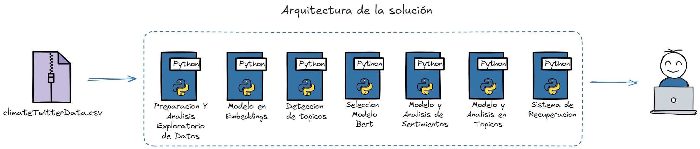
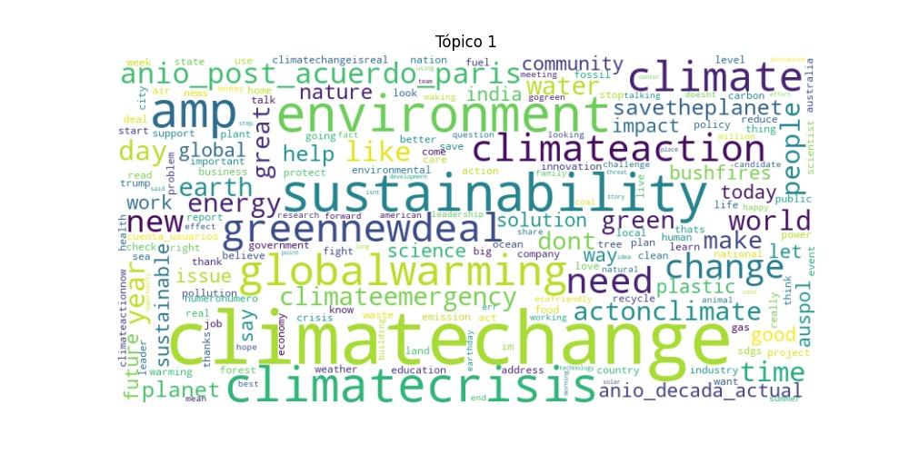
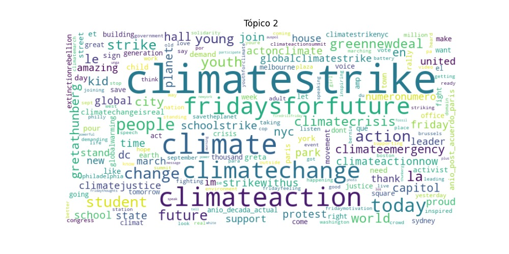

# Proyecto: Análisis de Tweets sobre el Cambio Climático

## Descripción

Este proyecto se enfoca en analizar el sentimiento y los temas clave presentes en los tweets relacionados con el cambio climático. A través de una serie de técnicas de procesamiento de lenguaje natural (NLP), minería de texto y sistemas de recuperación de información, se busca extraer conocimiento útil a partir de grandes volúmenes de texto.

## Arquitectura de la Solución



El flujo del proyecto sigue los siguientes pasos:

1. **Preparación y Análisis Exploratorio de Datos**:
   - Limpieza de los tweets, incluyendo la eliminación de emojis, URLs y nombres de usuarios.
   - Tokenización y lematización.
   - Representación del texto con Bag of Words (BoW) y reducción de dimensionalidad usando SVD.

2. **Modelo en Embeddings**:
   - Utilizamos el modelo pre-entrenado **SentenceTransformer** para generar embeddings de los tweets.
   - Los embeddings se almacenan en una base de datos vectorial (ChromaDB) para facilitar la recuperación de información.

3. **Detección de Tópicos**:
   - Aplicación del modelo LDA para identificar los principales tópicos en el conjunto de tweets.
   - Generación de nubes de palabras para cada tópico, como se muestra a continuación:

   ### Tópico 1:
   

   ### Tópico 2:
   

4. **Selección del Modelo BERT**:
   - Se selecciona y entrena un modelo basado en BERT para tareas de clasificación de sentimientos y análisis de temas.

5. **Análisis de Sentimientos**:
   - Se utiliza un modelo supervisado para clasificar el sentimiento de los tweets (positivo o negativo) y completar las columnas 'sentiment1' o 'sentiment2' en el dataset.
   - Clasificación de los tweets basados en etiquetas (hashtags) o tópicos generados por LDA.

6. **Modelo y Análisis en Tópicos**:
   - Se entrena un modelo de clasificación para predecir el grupo de pertenencia de cada tweet basado en el contenido (tópicos).

7. **Sistema de Recuperación de Información**:
   - Implementación de un sistema de consultas interactivo, donde los usuarios pueden realizar búsquedas por temas y recibir los tweets más relevantes en función de la similitud semántica.
   - Los resultados se devuelven con la distancia de similitud y el análisis de sentimiento.

## Instrucciones para Ejecución

1. **Requisitos**:
   - Python 3.8+
   - Paquetes necesarios en `requirements.txt`:
     - `transformers`
     - `pandas`
     - `scikit-learn`
     - `sentence-transformers`
     - `chromadb`
     - `nltk`

2. **Ejecución**:
   - Para la limpieza y análisis exploratorio de datos:
     ```bash
     python parte_1.py
     ```
   - Para generar los embeddings y almacenar en ChromaDB:
     ```bash
     python parte_2.py
     ```
   - Para la detección de tópicos y análisis de sentimientos:
     ```bash
     python parte_3.py
     python parte_4_predicciones.py
     ```
   - Para el sistema de recuperación de información:
     ```bash
     python parte_5.py
     ```


## Resultados

1. **Análisis de Sentimientos**: El modelo alcanzó una precisión del XX% en la clasificación de tweets en positivos y negativos.
2. **Detección de Tópicos**: Los tópicos detectados incluyen conceptos clave como `Acciones y movimientos climáticos` y `Conceptos generales de cambio climático`.
3. **Sistema de Recuperación**: El sistema permite realizar búsquedas interactivas y obtener resultados relevantes con análisis de sentimiento.

## Conclusión

Este proyecto demuestra cómo se pueden aplicar técnicas avanzadas de NLP y minería de texto para analizar grandes volúmenes de datos no estructurados. El sistema de recuperación basado en embeddings proporciona una forma eficiente de encontrar información relevante, mientras que el análisis de sentimientos y detección de tópicos ofrece valiosas perspectivas sobre el discurso público en torno al cambio climático.

---

